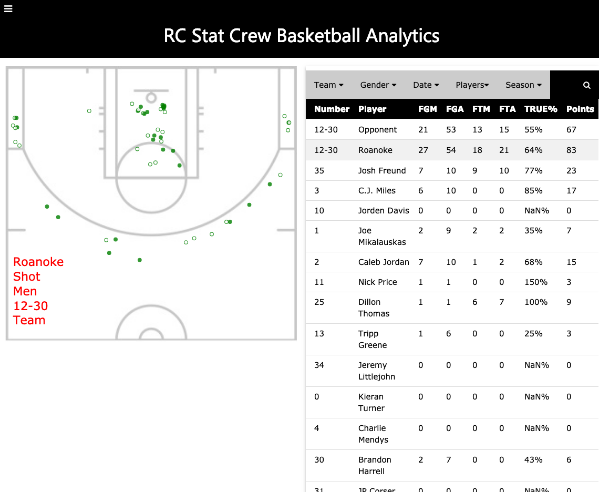
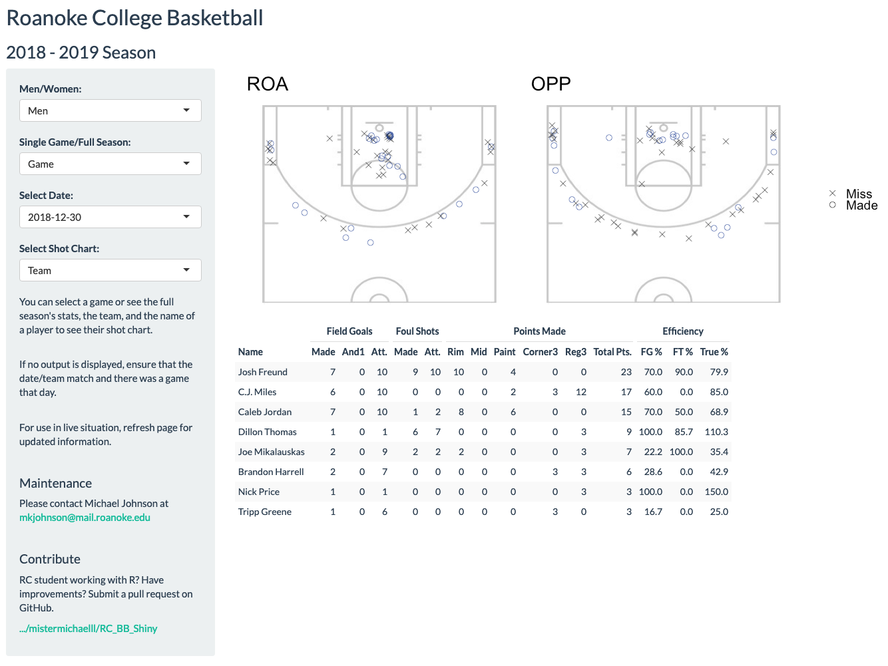

# Roanoke College Basketball Shiny App

  

## Overview
This is the repository for the Roanoke College Basketball Shiny App. This app is intended to replace our slightly antiguated "live" app, and provide a database-connected solution for coaches wishing to see analytics and shot charts from games. 

The live app looks like this:

  

Ourly newly created RShiny app looks like this:

  

A few design changes were made. Shot charts for the opposing teams are now side-by-side, allowing comparisons to be drawn more quickly. Missed shots are identified with an X marker while made shots are identified with an O. Colors are less invasive.  

[A static version of the app for the 2018-2019 season is available here.](https://mistermichaellll.shinyapps.io/rc_bb_static/)

## Usage Notes
You will need a file in the folder called `database_access.env` which contains the following: 

  - USERNAME=[username]
  - PASSWORD=[password]
  - DB=[database name]
  - HOST = math.roanoke.edu

This file is not included in the public version for privacy reasons. When deployed to a server, this file needs to be included. 

## Current Features
The current app is pretty simple, but provides a base for anyone wishing to improve on it. Currently, it supports:

  - Men/Womens team
  - Single game/full season
  - Date selection
  - Player selection
  - Automatic updating each season
  
## Desired Features
As always, there are some features that we hope to add in the future. These include:

  - Downloadable data/shot charts/etc. 
  - Player rosters accessed from database instead of a prewritten CSV 
  
## Possible Issues (and their possible solutions) 
There are a few ways that the code is structured that require attention every now and then. 

  - Rosters have to be updated manually until we find a way to upload them to the server (this will require an update)
  - We have yet to test the automatic updating, so this may require a patch in the future

