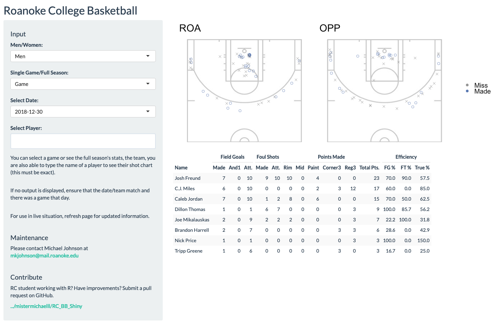

# Roanoke College Basketball Shiny App

  

## Overview
This is the repository for the Roanoke College Basketball Shiny App. This app is intended to replace our slightly antiguated "live" app, and provide a database-connected solution for coaches wishing to see analytics and shot charts from games. 

The live app looks like this:

  

Ourly newly created RShiny app looks like this:

  

A few design changes were made. Shot charts for the opposing teams are now side-by-side, allowing comparisons to be drawn more quickly. Missed shots are identified with an X marker while made shots are identified with an O. Colors are less invasive.  

## Current Features
The current app is pretty simple, but provides a base for anyone wishing to improve on it. Currently, it supports:

  - Men/Womens team
  - Single game/full season
  - Date selection
  - Player selection
  
## Desired Features
As always, there are some features that we hope to add in the future. These include:

  - Downloadable data/shot charts/etc. 
  - Player input selected instead of typed
